🐾 Challenge: API RESTful para Sistema Veterinário

API RESTful desenvolvida em Java com Spring Boot para o gerenciamento de clínicas veterinárias, tutores, pets e consultas. O projeto contempla operações completas de CRUD, persistência de dados relacional, paginação e documentação automatizada, seguindo as diretrizes da Sprint.

---

##  Integrantes do Grupo
* **Matheus Gianolli** — RM: 565258
* **Enzo Xavier Coelho** — RM: 563379
* **Gustavo Ribeiro Permagnani** — RM: 564995
* **Larissa Juvenal de Magalhaes** — RM: 566457
* **Julia Menezes** — RM: 565568

```text
Estrutura de pastas
-------------------

challenge-api/
├── documentos/
├── src/
│   ├── main/
│   │   ├── java/
│   │   │   └── br/com/challenge/
│   │   │       ├── config/
│   │   │       │   └── OpenApiConfig.java
│   │   │       ├── controllers/
│   │   │       │   ├── ClinicaController.java
│   │   │       │   ├── ConsultaController.java
│   │   │       │   ├── PetController.java
│   │   │       │   ├── TutorController.java
│   │   │       │   └── VeterinarioController.java
│   │   │       ├── dtos/
│   │   │       │   ├── ClinicaDTO.java
│   │   │       │   ├── ConsultaDTO.java
│   │   │       │   ├── PetDTO.java
│   │   │       │   ├── TutorDTO.java
│   │   │       │   └── VeterinarioDTO.java
│   │   │       ├── exceptions/
│   │   │       │   ├── GlobalExceptionHandler.java
│   │   │       │   └── ResourceNotFoundException.java
│   │   │       ├── models/
│   │   │       │   ├── Clinica.java
│   │   │       │   ├── Consulta.java
│   │   │       │   ├── Pet.java
│   │   │       │   ├── Tutor.java
│   │   │       │   └── Veterinario.java
│   │   │       ├── repositories/
│   │   │       │   ├── ClinicaRepository.java
│   │   │       │   ├── ConsultaRepository.java
│   │   │       │   ├── PetRepository.java
│   │   │       │   ├── TutorRepository.java
│   │   │       │   └── VeterinarioRepository.java
│   │   │       ├── services/
│   │   │       │   ├── ClinicaService.java
│   │   │       │   ├── ConsultaService.java
│   │   │       │   ├── PetService.java
│   │   │       │   ├── TutorService.java
│   │   │       │   └── VeterinarioService.java
│   │   │       └── ChallengeApplication.java
│   │   └── resources/
│   │       └── application.properties
│   └── test/
├── pom.xml
└── README.md
```

---

##  Tecnologias Utilizadas
* **Linguagem:** Java 17
* **Framework:** Spring Boot 3.2.5
* **Banco de Dados:** H2 Database (Memória para testes) e Oracle (Oficial)
* **Validação:** Jakarta Bean Validation
* **Documentação:** Swagger (Springdoc OpenAPI)
* **Testes:** Postman

>  **Nota de Implementação:** > Optou-se por aplicar esses recursos avançados (Cache e Query Methods) exclusivamente na entidade `Veterinario` como uma "Prova de Conceito" 

---


 Como Executar o Projeto
1. Clone o repositório na sua máquina:
   `https://github.com/MatheusGianolli/Challenge-java2026`
2. Importe o projeto na sua IDE (recomendado: IntelliJ IDEA).
3. Aguarde a sincronização das dependências do Maven.
4. Execute a classe principal `ChallengeApplication.java`.
5. Execute no botão verde logo ao lado de "	public static void main(String[] args) {"
		SpringApplication.run(ChallengeApplication.class, args);
	}
6. A API estará disponível e rodando na porta local: `http://localhost:8080`.

##  Documentação da API (Swagger)
A documentação interativa gerada automaticamente pelo Swagger contendo todos os endpoints, parâmetros e esquemas JSON pode ser acessada com a aplicação rodando no link:
 `http://localhost:8080/swagger-ui/index.html`

**Print do Swagger em funcionamento:**
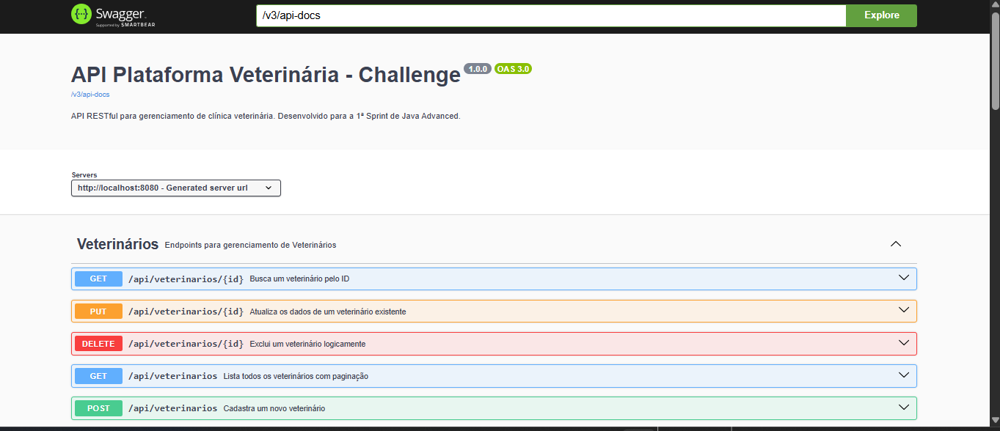


Na imagem abaixo, é possível observar a organização clara das rotas da API, separadas por domínios (entidades) e com a sinalização visual de todos os métodos HTTP (GET, POST, PUT e DELETE) implementados nos CRUDs:

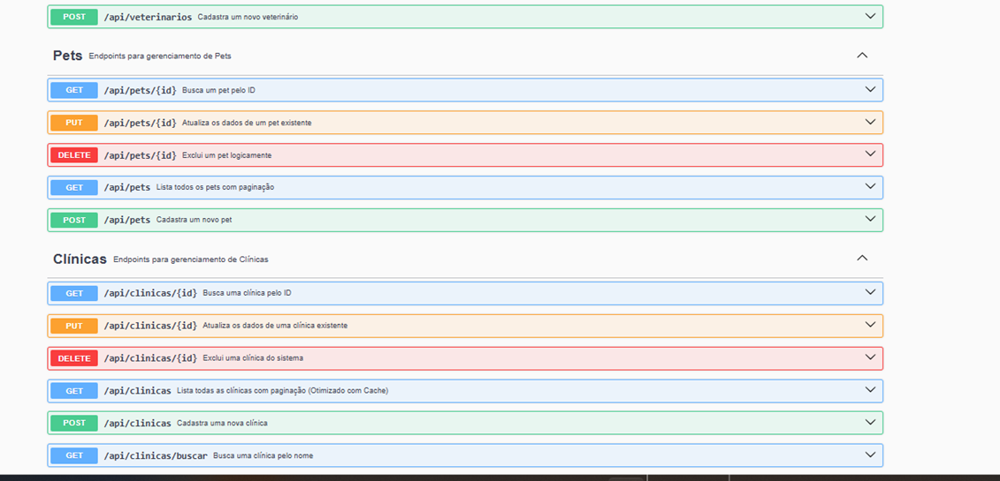
<br>
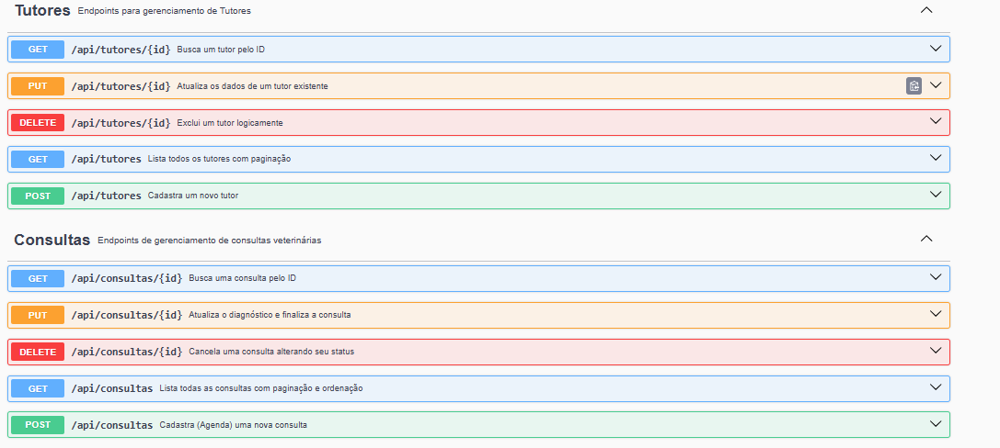
---

##   Testes de Requisição (Postman)
Para a validação das regras de negócio, todos os endpoints foram testados. O arquivo `.json` completo exportado da Collection do Postman encontra-se disponível na pasta `documentos/` deste repositório para importação e avaliação.


### 1. Cadastro de Tutor (POST)
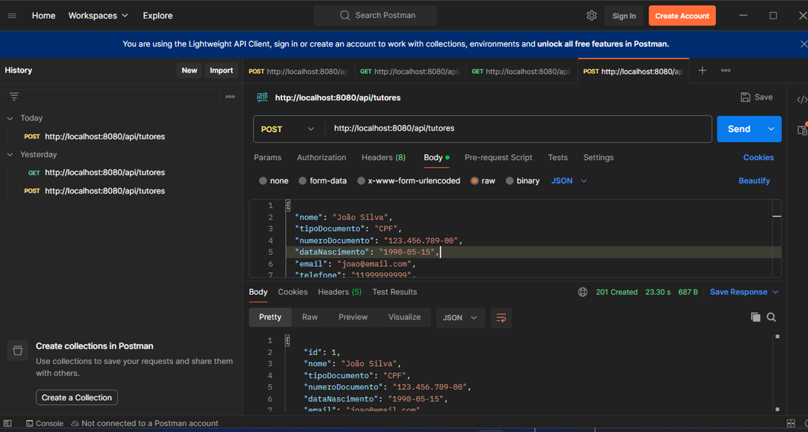

### 2. Listagem de Tutores com Paginação (GET)
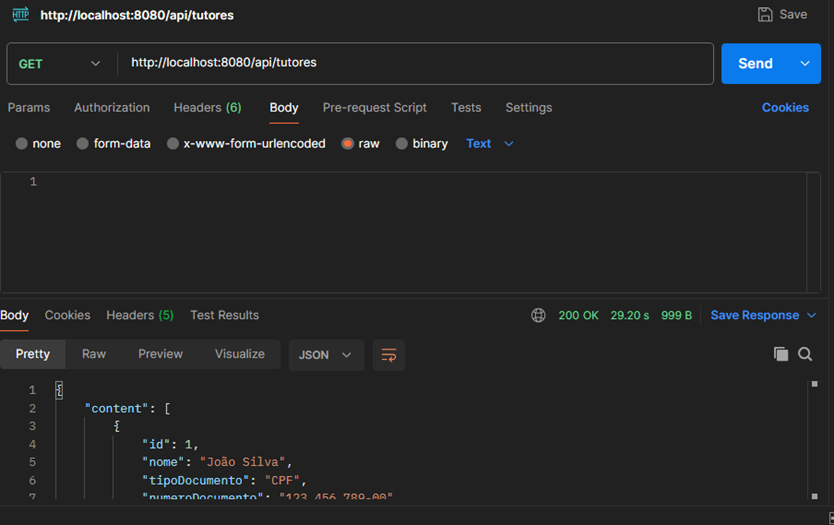

### 3. Cadastro de Clínica (POST)!
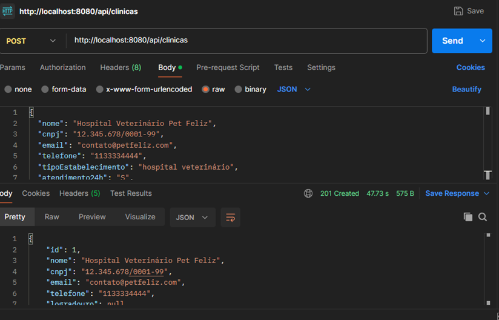

### 4. Cadastro de Veterinário (POST)
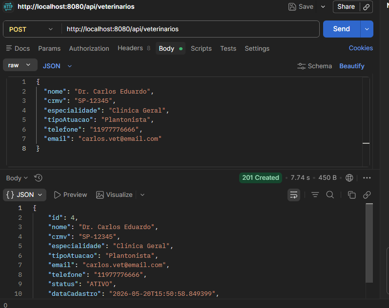

### 5. Cadastro de Pet (POST)
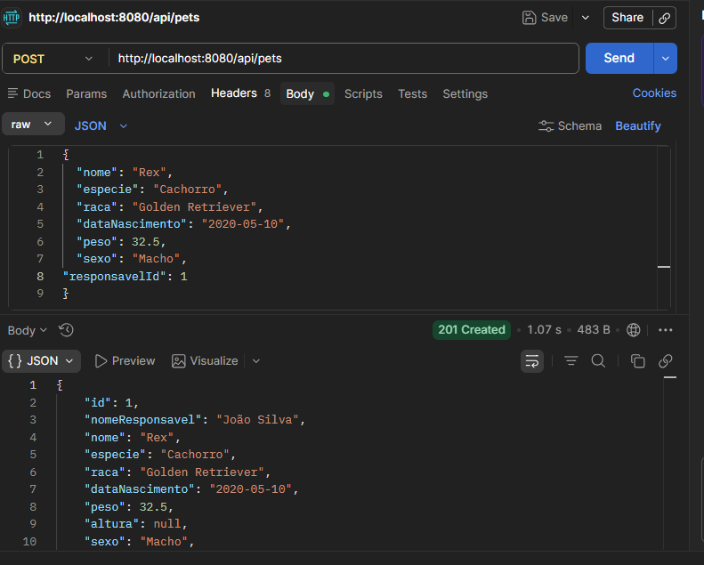

### 6. Agendamento de Consulta (POST)
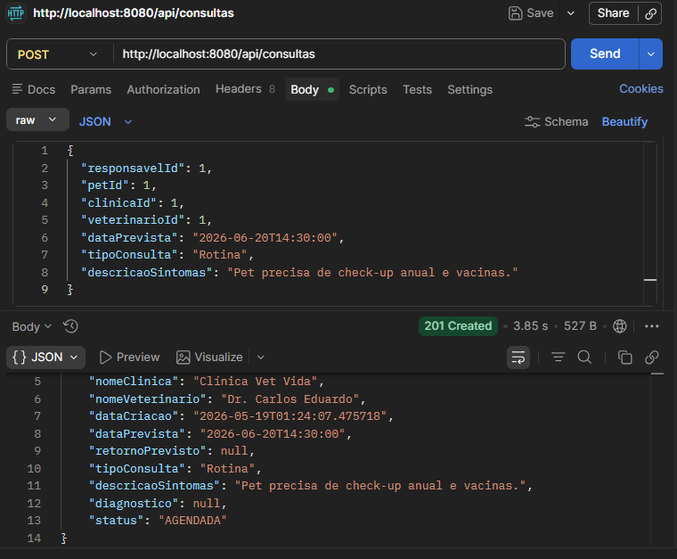

#### 7. Lançamento de Diagnóstico de Consulta (PUT)
Demonstração da atualização do prontuário médico. A requisição insere o diagnóstico final e o sistema altera automaticamente o status da consulta para `REALIZADA`.
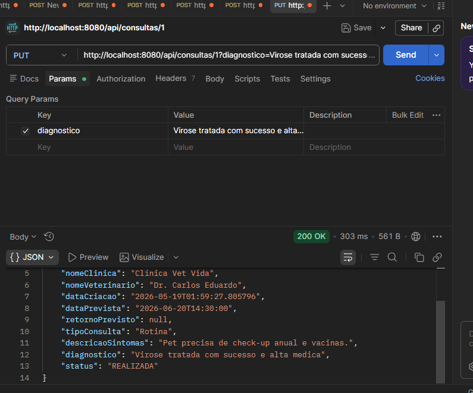
#### 8. Cancelamento de Consulta (DELETE)
Demonstração da exclusão lógica (Soft Delete). O registro não é apagado do banco de dados para manter o histórico médico íntegro, mas seu status é atualizado para `CANCELADA`.
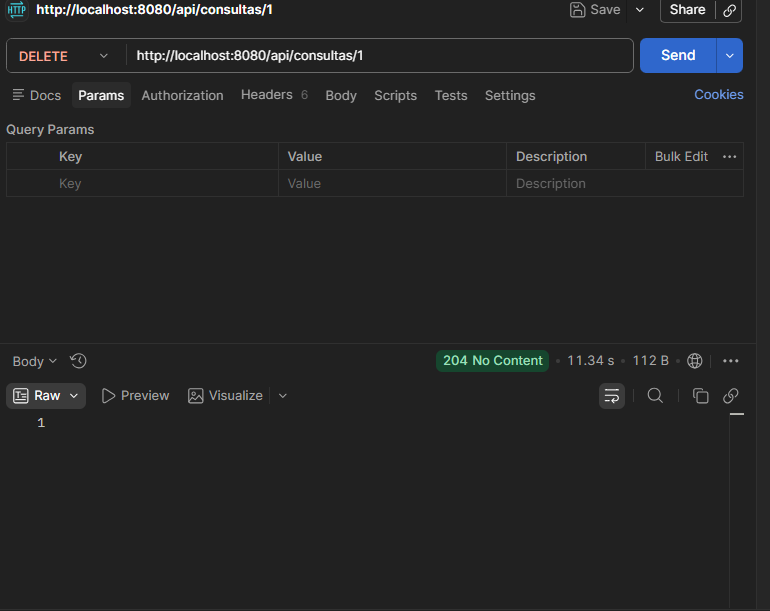

#### 9. Atualização de Dados do Pet (PUT)
Demonstração da atualização das informações de um paciente (Pet). A requisição envia um novo payload JSON e o sistema sobrescreve os dados no banco de dados.
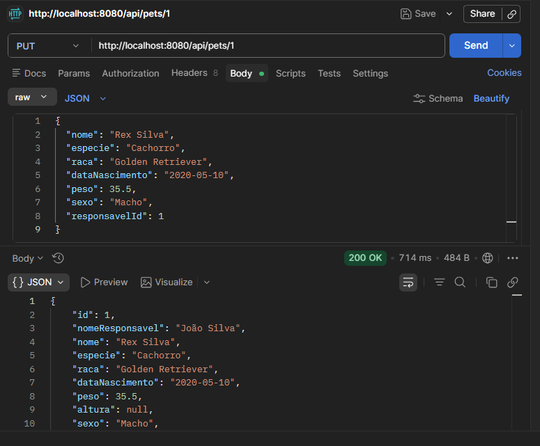

#### 10. Exclusão de Pet (DELETE)
Demonstração da remoção de um Pet do sistema. O endpoint recebe o ID via parâmetro na URL e deleta o registro correspondente do banco de dados.
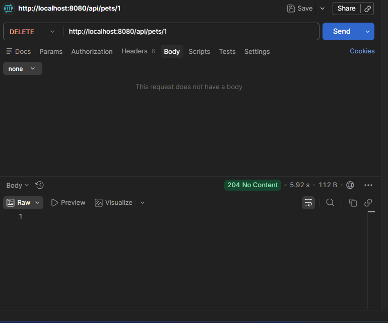


---
---

##  Tratamento de Erros e Exceções (Validação Funcional)
Conforme solicitado nos requisitos técnicos, a aplicação utiliza um mapeador global de exceções (`@RestControllerAdvice`). Quando um campo obrigatório viola as regras do Bean Validation (ex: enviar um campo obrigatório em branco), a API intercepta a requisição e retorna o Status **400 Bad Request** com os detalhes amigáveis do erro.

**Prova do Tratamento de Exceções de Validação:**
-Como vemos no print abaixo caso o usuario esqueça de preencher um campo obrigatorio(no caso abaixo o nome ) graças a nossa excepition ele ira retornar um 404 bad request e sinalizara para o usuario que o campo é obrigatorio
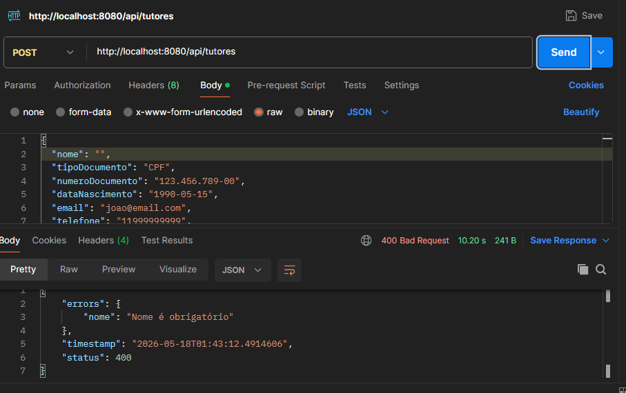

---

##  Modelagem de Dados e Arquitetura
### Diagrama de Classes
Representação da arquitetura orientada a objetos das entidades do sistema mapeadas no Java:
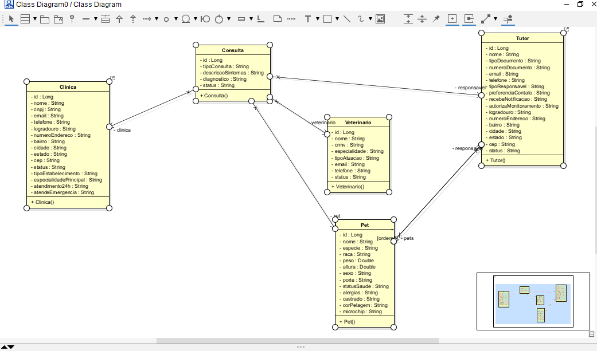

---

##  Divisão de Tarefas e Cronograma
A gestão ágil do projeto e a divisão técnica das responsabilidades desenvolvidas por cada integrante do grupo durante esta Sprint estão documentadas no arquivo em anexo.

* **Consulte o arquivo:** `cronograma.pdf` (localizado na pasta `documentos/`).
