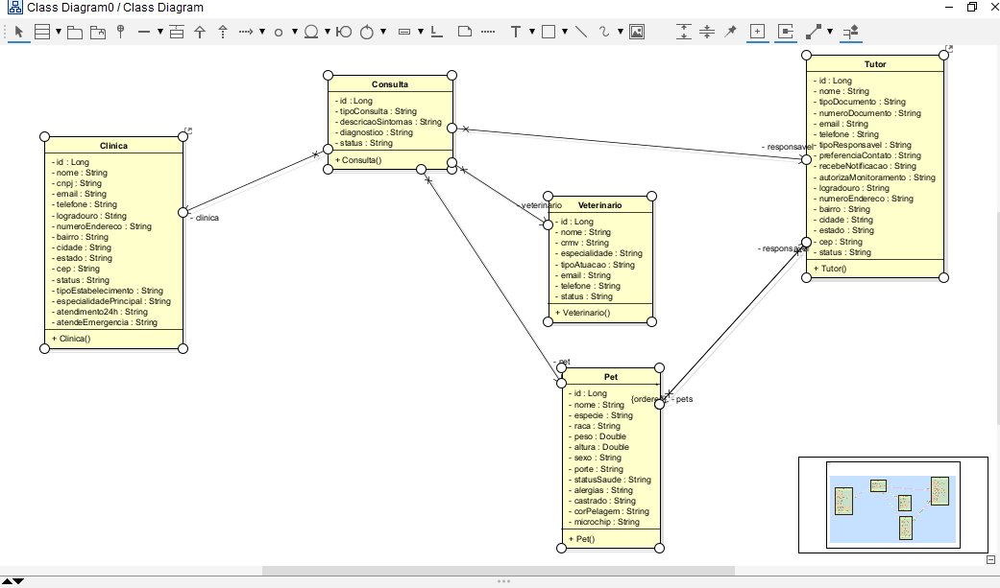

# 🐾 PetCare API

API RESTful desenvolvida em Java com Spring Boot para o gerenciamento de clínicas veterinárias, tutores, pets, veterinários e consultas.

O projeto foi desenvolvido como parte do Challenge da Sprint de Java Advanced, aplicando conceitos de arquitetura em camadas, persistência de dados, validação, autenticação, paginação, documentação de APIs e operações CRUD.

## 👥 Integrantes do Grupo

| Integrante | RM |
|---|---|
| Matheus Gianolli | 565258 |
| Enzo Xavier Coelho | 563379 |
| Gustavo Ribeiro Permagnani | 564995 |
| Larissa Juvenal de Magalhães | 566457 |
| Julia Menezes | 565568 |

## 📌 Sobre o Projeto

O PetCare API tem como objetivo centralizar o gerenciamento das informações de uma clínica veterinária, permitindo o controle de:

- Tutores responsáveis pelos animais.
- Pets cadastrados.
- Clínicas veterinárias.
- Veterinários.
- Consultas e atendimentos.
- Diagnósticos e status de consultas.

A aplicação segue o padrão REST, disponibilizando endpoints HTTP para operações de cadastro, consulta, atualização, paginação e exclusão lógica de registros.

## 🛠️ Tecnologias Utilizadas

### Backend

- Java 17
- Spring Boot 3.2.5
- Spring Web
- Spring Data JPA
- Spring Security
- Bean Validation / Jakarta Validation
- Oracle Database
- Flyway
- SpringDoc OpenAPI / Swagger
- Maven

### Frontend

A interface web foi desenvolvida separadamente para consumir a API:

- React
- Vite
- TypeScript
- HTML5
- CSS
- Fetch API

### Testes e documentação

- Postman
- Swagger UI
- Oracle Database
- Git e GitHub

## 🏗️ Arquitetura do Projeto

O backend utiliza uma arquitetura organizada em camadas, separando as responsabilidades da aplicação.

```
challenge-api/
├── documentos/
│   ├── Challenger_Clyvo.pdf
│   └── arquivos de testes do Postman
│
├── src/
│   ├── main/
│   │   ├── java/
│   │   │   └── br/com/challenge/
│   │   │       ├── config/
│   │   │       ├── controllers/
│   │   │       ├── dtos/
│   │   │       ├── exceptions/
│   │   │       ├── models/
│   │   │       ├── repositories/
│   │   │       └── services/
│   │   │
│   │   └── resources/
│   │       ├── db/migration/
│   │       └── application.properties
│   │
│   └── test/
│
├── pom.xml
└── README.md
```

### Responsabilidade das camadas

| Camada | Responsabilidade |
|---|---|
| controllers | Receber requisições HTTP e retornar respostas |
| services | Concentrar as regras de negócio |
| repositories | Realizar o acesso ao banco de dados |
| models | Representar as entidades persistidas |
| dtos | Controlar os dados de entrada e saída da API |
| exceptions | Centralizar o tratamento de erros |
| config | Configurações de segurança, documentação e infraestrutura |

## 🧩 Entidades Principais

O sistema possui as seguintes entidades:

- Tutor
- Pet
- Clínica
- Veterinário
- Consulta

### Relacionamentos principais

- Um tutor pode possuir vários pets.
- Um pet pertence a um tutor.
- Uma consulta está relacionada a um pet.
- Uma consulta está relacionada a um tutor responsável.
- Uma consulta está relacionada a uma clínica.
- Uma consulta está relacionada a um veterinário.

## 🔐 Autenticação e Autorização

A API utiliza Spring Security com autenticação HTTP Basic.

As credenciais são mantidas em memória para fins acadêmicos e de demonstração.

### Usuários disponíveis

| Usuário | Senha | Perfil |
|---|---|---|
| admin | admin123 | Administrador |
| veterinario | vet123 | Veterinário |

### Permissões

- Usuários autenticados podem acessar os recursos permitidos da API.
- O perfil ADMIN possui acesso ao gerenciamento de veterinários.
- Operações de exclusão são restritas ao perfil ADMIN.
- O gerenciamento de veterinários é protegido por autorização específica.

> Em um ambiente de produção, as credenciais não devem ser mantidas diretamente no código ou em memória. Para esta entrega, essa abordagem foi utilizada com finalidade didática.

## ⚙️ Funcionalidades

### Tutores

- Cadastro de tutores.
- Consulta de tutor por ID.
- Listagem paginada.
- Atualização de dados.
- Exclusão lógica.

### Pets

- Cadastro de pets.
- Consulta de pet por ID.
- Listagem paginada.
- Atualização de dados.
- Exclusão de registros conforme as regras implementadas.

### Clínicas

- Cadastro de clínicas.
- Consulta de clínica por ID.
- Listagem paginada.
- Busca de clínica por nome.
- Atualização de dados.
- Exclusão lógica.

### Veterinários

- Cadastro de veterinários.
- Consulta de veterinário por ID.
- Listagem paginada.
- Filtro por especialidade.
- Atualização de dados.
- Ativação e desativação de veterinários.
- Exclusão lógica.
- Controle de acesso por perfil administrativo.

### Consultas

- Agendamento de consultas.
- Consulta por ID.
- Listagem paginada.
- Atualização de diagnóstico.
- Alteração automática do status para REALIZADA.
- Cancelamento lógico da consulta.
- Manutenção do histórico dos atendimentos.

## 🌐 Endpoints Principais

A API é executada, por padrão, na porta 8080.

```
http://localhost:8080
```

### Tutores

| Método | Endpoint | Descrição |
|---|---|---|
| GET | /api/tutores | Lista tutores com paginação |
| GET | /api/tutores/{id} | Busca tutor por ID |
| POST | /api/tutores | Cadastra um tutor |
| PUT | /api/tutores/{id} | Atualiza um tutor |
| DELETE | /api/tutores/{id} | Realiza a exclusão lógica |

### Pets

| Método | Endpoint | Descrição |
|---|---|---|
| GET | /api/pets | Lista pets com paginação |
| GET | /api/pets/{id} | Busca pet por ID |
| POST | /api/pets | Cadastra um pet |
| PUT | /api/pets/{id} | Atualiza um pet |
| DELETE | /api/pets/{id} | Exclui um pet |

### Clínicas

| Método | Endpoint | Descrição |
|---|---|---|
| GET | /api/clinicas | Lista clínicas com paginação |
| GET | /api/clinicas/{id} | Busca clínica por ID |
| GET | /api/clinicas/buscar | Busca clínica por nome |
| POST | /api/clinicas | Cadastra uma clínica |
| PUT | /api/clinicas/{id} | Atualiza uma clínica |
| DELETE | /api/clinicas/{id} | Realiza a exclusão lógica |

### Veterinários

| Método | Endpoint | Descrição |
|---|---|---|
| GET | /api/veterinarios | Lista veterinários com paginação |
| GET | /api/veterinarios/{id} | Busca veterinário por ID |
| POST | /api/veterinarios | Cadastra um veterinário |
| PUT | /api/veterinarios/{id} | Atualiza um veterinário |
| PATCH | /api/veterinarios/{id}/status | Altera o status do veterinário |
| DELETE | /api/veterinarios/{id} | Realiza a exclusão lógica |

Exemplo de alteração de status:

```
PATCH /api/veterinarios/1/status?status=INATIVO
```

Para reativação:

```
PATCH /api/veterinarios/1/status?status=ATIVO
```

### Consultas

| Método | Endpoint | Descrição |
|---|---|---|
| GET | /api/consultas | Lista consultas com paginação |
| GET | /api/consultas/{id} | Busca consulta por ID |
| POST | /api/consultas | Agenda uma consulta |
| PUT | /api/consultas/{id} | Atualiza o diagnóstico |
| DELETE | /api/consultas/{id} | Cancela uma consulta |

## 📄 Documentação da API

A documentação interativa é disponibilizada pelo Swagger UI.

Com a aplicação em execução, acesse:

```
http://localhost:8080/swagger-ui/index.html
```

A documentação permite:

- Visualizar todos os endpoints.
- Consultar parâmetros.
- Visualizar os modelos de requisição e resposta.
- Testar as operações diretamente pelo navegador.
- Conferir os códigos HTTP retornados.

## ▶️ Como Executar o Backend

### Pré-requisitos

Antes de executar o projeto, certifique-se de possuir:

- Java 17 instalado.
- Maven instalado ou Maven Wrapper disponível.
- Oracle Database configurado.
- IDE compatível, como IntelliJ IDEA, Eclipse ou VS Code.
- Git instalado.

### 1. Clonar o repositório

```bash
git clone https://github.com/MatheusGianolli/Challenge-java2026.git
```

### 2. Acessar a pasta do projeto

```bash
cd Challenge-java2026
```

### 3. Configurar o banco de dados

Configure as informações de conexão com o Oracle no arquivo:

```
src/main/resources/application.properties
```

Exemplo de configuração:

```properties
spring.datasource.url=jdbc:oracle:thin:@localhost:1521:XE
spring.datasource.username=SEU_USUARIO
spring.datasource.password=SUA_SENHA
spring.datasource.driver-class-name=oracle.jdbc.OracleDriver

spring.jpa.hibernate.ddl-auto=validate
spring.jpa.show-sql=false

spring.flyway.enabled=true
```

Os valores de conexão devem ser ajustados conforme a configuração do ambiente utilizado.

### 4. Executar a aplicação

Pelo Maven Wrapper no Windows:

```bash
mvnw.cmd spring-boot:run
```

Ou, caso o Maven esteja instalado:

```bash
mvn spring-boot:run
```

Também é possível executar a classe principal pela IDE:

```
ChallengeApplication.java
```

### 5. Acessar a API

```
http://localhost:8080
```

Swagger:

```
http://localhost:8080/swagger-ui/index.html
```

## 💻 Interface Web

## Interface web complementar

Além da API desenvolvida em Java com Spring Boot, o projeto possui uma interface web desenvolvida em React e Vite para facilitar a visualização e utilização dos recursos disponibilizados pela API.

A interface permite acessar as principais funcionalidades do sistema, realizando operações integradas ao backend por meio de requisições HTTP.

A demonstração da interface e de sua integração com a API está disponível no vídeo de apresentação.

## 🧪 Testes de Requisição

As funcionalidades da API foram validadas utilizando o Postman e o Swagger.

Foram realizados testes envolvendo:

- Cadastro de tutores.
- Listagem paginada de tutores.
- Cadastro de clínicas.
- Cadastro de veterinários.
- Cadastro de pets.
- Agendamento de consultas.
- Atualização de diagnóstico.
- Alteração do status de consultas.
- Cancelamento lógico de consultas.
- Atualização de dados.
- Exclusão lógica de registros.
- Validação de autenticação e autorização.

Os arquivos utilizados nos testes podem ser encontrados na pasta:

```
documentos/
```

## 📊 Regras de Negócio Implementadas

Entre as regras aplicadas no projeto, destacam-se:

- Validação dos dados recebidos nas requisições.
- Separação entre entidades e DTOs.
- Paginação nas listagens.
- Tratamento centralizado de exceções.
- Busca de recursos por ID.
- Controle de acesso com Spring Security.
- Exclusão lógica em entidades que precisam preservar histórico.
- Alteração automática do status da consulta após o lançamento do diagnóstico.
- Controle de status dos veterinários.
- Filtros por especialidade na listagem de veterinários.

## 🗃️ Persistência e Migrações

O projeto utiliza o Oracle Database como banco de dados oficial.

O controle de versão do banco é realizado por meio do Flyway, permitindo organizar e executar scripts de migração de forma controlada.

As migrações ficam localizadas em:

```
src/main/resources/db/migration/
```

Essa abordagem evita depender exclusivamente da criação automática das tabelas pelo Hibernate e permite maior controle sobre a evolução do banco de dados.

## 🚀 Melhorias e Recursos Técnicos

Durante o desenvolvimento, foram aplicados recursos adicionais para aprimorar a API:

- Arquitetura em camadas.
- DTOs para entrada e saída de dados.
- Validações com Jakarta Bean Validation.
- Paginação utilizando Pageable.
- Consultas customizadas com Spring Data JPA.
- Tratamento global de exceções.
- Autenticação com Spring Security.
- Autorização por perfil.
- Documentação automática com Swagger.
- Exclusão lógica.
- Controle de status de veterinários.
- Versionamento de banco com Flyway.

## 📁 Repositório

Repositório oficial:

```
https://github.com/MatheusGianolli/Challenge-java2026
```
##  Modelagem de Dados e Arquitetura
### Diagrama de Classes
Representação da arquitetura orientada a objetos das entidades do sistema mapeadas no Java:


---
## 📌 Considerações Finais

O projeto demonstra a construção de uma API RESTful utilizando Java e Spring Boot, integrando persistência de dados, regras de negócio, segurança, documentação e testes de requisições.

A solução foi estruturada de forma modular para facilitar a manutenção, a evolução das funcionalidades e a integração com diferentes interfaces consumidoras da API.

##  Divisão de Tarefas e Cronograma
A gestão ágil do projeto e a divisão técnica das responsabilidades desenvolvidas por cada integrante do grupo durante esta Sprint estão documentadas no arquivo em anexo.

* **Consulte o arquivo:** `Challenger Clyvo.pdf` (localizado na pasta `documentos/`).
